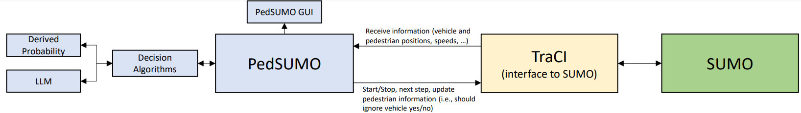
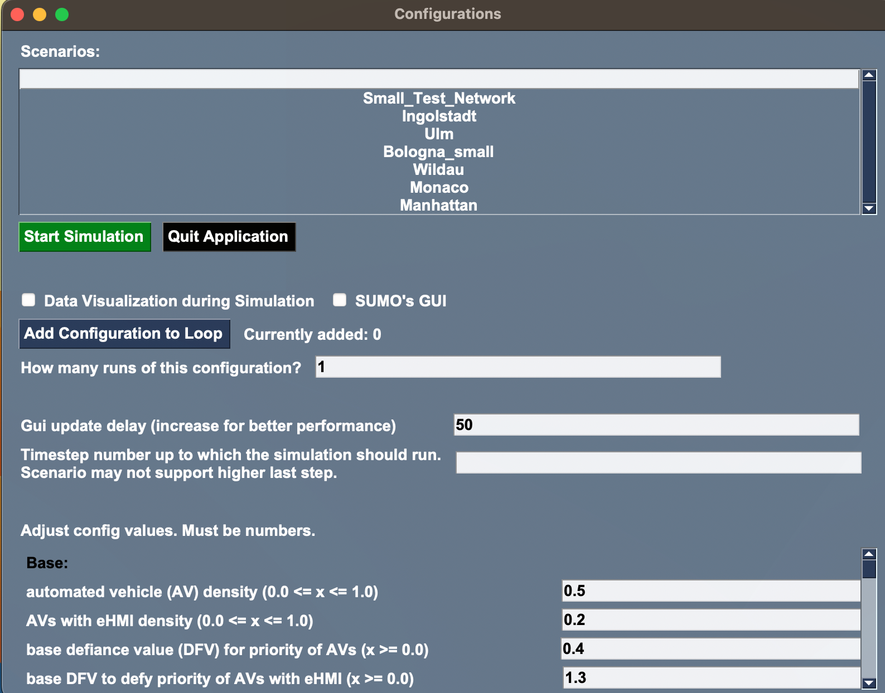
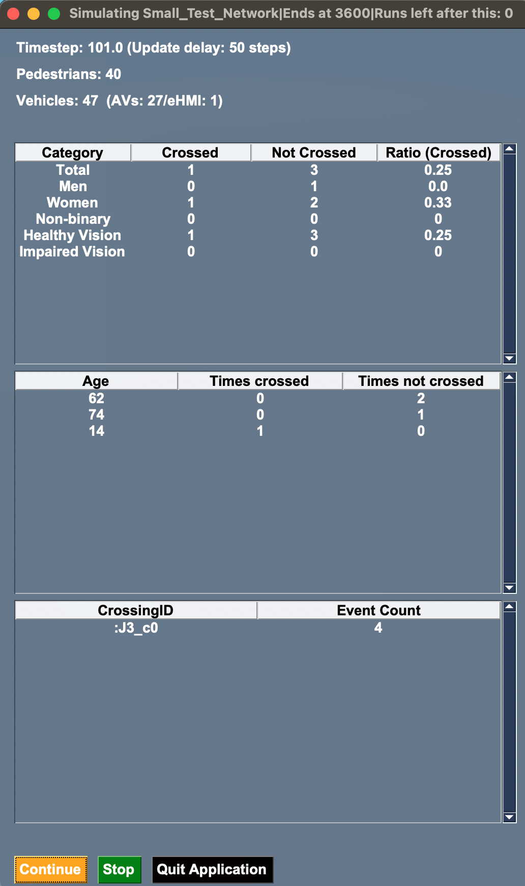
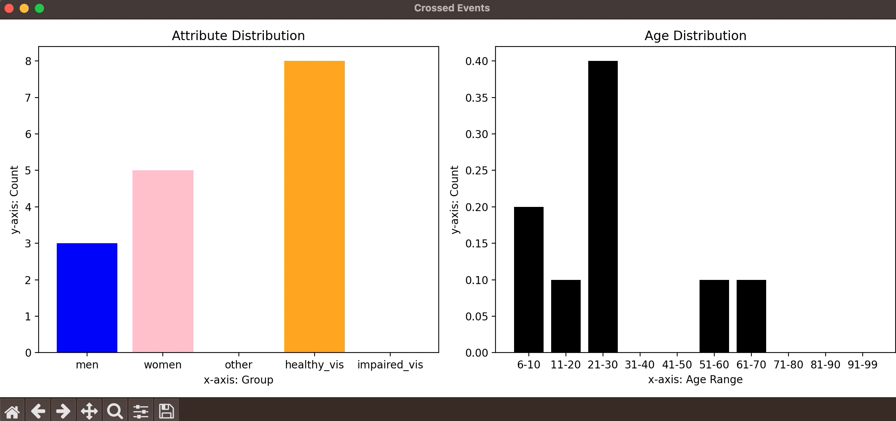

# PedSUMO - Pedestrian Crossings in [SUMO](https://www.eclipse.org/sumo/) 
Short Paper at [HRI '24](https://humanrobotinteraction.org/2024/), doi: [10.1145/3610977.3637478](https://dl.acm.org/doi/10.1145/3610977.3637478)

[](https://doi.org/10.1145/3610977.3637478)


[Mark Colley](https://scholar.google.de/citations?user=Kt5I7wYAAAAJ&hl=de&oi=ao), Julian Czymmeck, Mustafa Kücükkocak, [Pascal Jansen](https://scholar.google.de/citations?user=cR1_0-EAAAAJ&hl=en), [Enrico Rukzio](https://scholar.google.de/citations?user=LEu4D5gAAAAJ&hl=de&oi=ao)


## Downloading the `resources` Directory
Due to limitations with GIT LFS, specifically the quota per project (1GB per month), we have provided an alternative method to download the `resources` directory.
Please use the following Google Drive link to download the `resources` directory:
[Download Resources](https://drive.google.com/file/d/1QdxX8_j1YggWxMeIVQcxMbVKmSrN1a92/view?usp=drive_link)

After downloading, replace the existing `resources` folder in your project with the downloaded folder.


## Introduction

### Project SumoWithAVs (or 'Investigating Macroscopic Effects of Automated Vehicles on Traffic')
[SUMO](https://www.eclipse.org/sumo/) (Simulation of Urban MObility)  is "an open source, highly portable, microscopic and 
continuous multi-modal traffic simulation package designed to handle large networks" (https://www.eclipse.org/sumo/).

This project concerns the effects of automated vehicles (AVs) in traffic and how their interaction with pedestrians lead
to different (especially negative) outcomes when it comes to the fluent movement
of traffic. Using SUMO, this is done by making different attributes of pedestrians
such as age and gender, affect their decision-making, making them more or less likely to respect the priority of AVs
at unprioritized crossings. If, by chance, a pedestrian decides to ignore the AV and cross the street at an unintended
place, the AV (realistically) has to stop. When this happens at a larger scale and an increasing number of AVs
in public traffic, this will result in less favorable real-world scenarios. This effect is stronger with an increasing number of AVs with an external human-machine interface (eHMI) as an eHMI serves as a communication between the human and the vehicles, contributing to a higher feeling of safety around AVs. \
This project seeks to measure these changes
after each simulation using different variables (such as density of AVs in traffic), so that they can be evaluated.

We always tried to make factors (probabilities, numbers, values, calculations, etc.) impacting traffic as reasonable and factual as possible. For that, we either used scientific resources or made educated guesses.

### Frameworks and Libraries
- [SUMO](https://www.eclipse.org/sumo/) (version 1.21.0 and up) 
    1. traci (python package)
    2. sumolib (python package)
- [Python 3](https://www.python.org/about/) (tested with version 3.11, 3.12, and 3.13)
- [PySide6](https://doc.qt.io/qtforpython/) (Qt-based GUIs for configuration and simulation dashboards)
- [Matplotlib](https://matplotlib.org) (for visualization of data during simulation)
- [Transformers](https://huggingface.co/docs/transformers/installation)
- XML, CSV (file formats) \
[Tested with Windows 10, Windows 11, and macOS Ventura]

Generally, we use the latest versions of each package to improve speed and accuracy. However, using older libraries should also work.


### Added Features
- Addition of AV priority-ignore behavior in pedestrians
    1. Priority of AVs can now be ignored by pedestrians. They can ignore AVs at unprioritized crossings (crossings where nobody should actually cross the street). The likelihood of a pedestrian ignoring an AV is determined by certain factors:
    2. We added age, gender (male, female, other), and vision health (healthy or impaired) to pedestrians. The probability of an attribute to be applied to a pedestrian can be changed. Their impact on pedestrian priority-respect behavior can also be adjusted.
    3. Now, there are various changeable factors ('defiance values') that impact the decision-making of pedestrians. These factors are used to calculate values to influence their interaction with AVs realistically.
- Adjusted (part of) several maps ("scenarios") to work with our code (https://sumo.dlr.de/docs/Data/Scenarios.html):
    1. small test scenario
    2. Ingolstadt
    3. Ulm
    4. Monaco
    5. Bologna
    6. Wildau
    7. Manhattan (very processor-intensive)
- Increased usability
    1. We added a configuration GUI for easy customization of values and easy simulation of several scenarios in a row
    2. We added a user-friendly GUI with additional data visualization to provide information during simulation time
    3. We added command line functionality with looping, allowing for several simulations in a row without interruption
    4. Addition of result files after a simulation and quick conversion of all XML result files of a simulation to CSV.
- Usage of LLMs to derive a crossing decision: We currently use [flan-alpaca-large](https://huggingface.co/declare-lab/flan-alpaca-large) but recommend [flan-alpaca-gpt4-xl](https://huggingface.co/declare-lab/flan-alpaca-gpt4-xl) if you have sufficient compute and RAM. `Attention: Highly Experimental and a CUDA graphics card is required.`

## How to Start

First, you need all resources to run the program. Follow these 4 steps:

1. Install a version of Python 3 - we use 3.11: https://www.python.org/downloads/
2. Install SUMO (go to the section for your operating system): https://sumo.dlr.de/docs/Downloads.php
3. Set `SUMO_HOME` (e.g., `C:\Program Files (x86)\Eclipse\Sumo\bin` on Windows)
4. Clone this project into a folder. First, go into a folder of your choice using the command on your terminal:
```console
cd [path to folder of your choice]
```
Then, clone this repository using
```console
git clone git@github.com:M-Colley/pedsumo.git
```
or
```console
git clone https://github.com/M-Colley/pedsumo.git
```
4. Install PySide6 and Matplotlib. You can just execute
```console
pip install -r [path to requirements.txt of this project]
```

5. Install Transformers and dependencies if you want to use LLMs. 

```console
pip install -r [path to requirements_llm.txt of this project]
```

in the console (e.g., `Command Prompt` in Windows. You may have to use `pip3` if `pip` does not work.)

### Run automated tests

From the project root, run:
```console
python -m unittest discover -v
```

The resources of this project are SUMO scenarios. 'Scenario' may refer to all files needed to run a simulation, or it may refer to the simulation map itself. Available scenarios were mentioned above.

There are two options to use the program: via a GUI or command line. You can technically start SumoWithAVs without the command line or GUI (by setting `guiOn` and `sumo_GuiOn` to `False` in `config.py` and running `main.py`), but this is generally not advised. If you do, make sure to include an `end value` for a timestep in the `.sumocfg` of the scenario, or else the simulation will always stop at 3600 timesteps. Example:
```xml
    <time>
      <end value="4500"/>
    </time>
```

### Using the GUI
If you run `main.py` (with `guiOn` set to True in `config.py`) the configuration GUI will start first.



You can choose the scenario you want to simulate at the top. By ticking the box, you can activate
data visualization during the simulation (scroll further down for more information).
You can also change how many timesteps (1 processed timestep equals
the simulation of a second in the real world) between each 
update of the GUI during the simulation there are (more information further down). Also, adjust at what timestep
you want the simulation to end automatically if needed. If no value is given, the simulation will stop at timestep 3600.

In the bottom section, you can adjust several variables that affect the probability of pedestrians to ignore AVs
at unprioritized crossings.

You can use SUMO's GUI by ticking the box next to "SUMO's GUI". This will show you the scenario during the simulation.

Press 'Start Simulation' if you want to simulate the scenario.

You can also use the loop functionality:
1. Adjust the configuration data as you please (including the update delay and the last simulation step).
2. Click on "Add Configuration to Loop". This will change the "Start Simulation" button to "Start Loop" and your current scenario with its configurations will be added to a loop queue. You can see the amount of simulations in your queue next to the "Add" button. You can also adjust how often you want that exact configuration to be added to the queue.
3. Click on "Start Loop" and all your simulations with your specified configurations will run. You can now leave the program to do the simulations. This is helpful if you suspect your simulations might take a long time.



During the simulation, a second GUI will display different kinds of information.\
At the top, you will see general information. Next to the 'vehicles' counter, you will see the amount of vehicles that are AVs, and the 'eHMI' counter describes the amount of AVs with eHMI within the AV counter. \
The numbers in the tables generally refer to crossing events where a pedestrian had to choose whether or not
to cross at an unprioritized crossing while ignoring an AV's priority. The 'Ratio' column in the first table is the
ratio of events where someone with a certain attribute ignored an AV to cross the street compared to the total
number of crossing events of the group with that attribute (amount of 'Crossed' divided by total amount).\
The 'crossingID' table describes the amount of crossing events at a specific crossing.

You can pause ('Pause' button) or completely stop and end ('Stop' button) the simulation at any time.

If you previously (in the config GUI window) ticked the box for data visualization, a window will be shown
during the simulation that display two charts: Both show the number of people in a certain group
that decided to cross when they had to choose whether to disrespect an AV's priority. One chart shows
five different attributes and the other shows age groups:



### Using the Command Line
The command line is primarily useful for the looping functionality (if you want to simulate a scenario several times in a row automatically). Note that the command line runs simulations to timestep 3600 (1 hour in the real world) by default if not specified.

In order to use the command line, execute main.py using Python 3 (the `python` command can be, if configured, also `python3`):
```console
python main.py --nogui
```
You can add more arguments to the line. To see all additional options, use
```console
python main.py --help
```
This will show you the following list:
```console
options:
  -h, --help            show this help message and exit
  --nogui               run the commandline version of sumo
  -v {n,v}, --verbosity {n,v}
                        verbosity of the command line output. Options are n (default) and v
  --scenario {Ulm,Ingolstadt,Monaco,Bologna,Wildau,Manhattan,Test}
                        default = Test. Defines the scenario you want to simulate. Choices are: Ulm, Ingolstadt, Monaco, Bologna, Wildau, Manhattan and Test
  --scenario_path SCENARIO_PATH
                        Alternative to --scenario: defines the path to the .sumocfg you want to simulate. Value should be an existing path to a valid .sumocfg file.

loop options:
  -l, --loop            run the simulation multiple times in a row, looping through av_density, ehmi_density and base_automated_vehicle_defiance.
  --av_step_size {[0.0,1.0]}
                        default = 0.1. Only useful when the --loop option is set. Defines the step size for the density of automated vehicles in the loop. Value should be between 0.0 and 1.0 as float.
                        Setting this value to exactly 0.0 disables looping over av_density instead.
  --ehmi_step_size {[0.0,1.0]}
                        default = 0.1. Only useful when the --loop option is set. Defines the step size for the density of automated vehicles with ehmi in the loop. Value should be between 0.0 and 1.0
                        as float. Setting this value to exactly 0.0 disables looping over ehmi_density instead.
  --defiance_step_size {[0.0,1.0]}
                        default = 0.1. Only useful when the --loop option is set. Defines the step size for the base automated vehicle defiance in the loop.Value should be between 0.0 and 1.0 as
                        float.Setting this value to exactly 0.0 disables looping over this variable instead.
  --density {[0.0,1.0]}
                        default = 0.0. Only useful when combined with the --loop option. Defines the lower bound for the used av_density in the loop. Value should be between 0.0 and 1.0 as float.
  --defiance {[0.0,1.0]}
                        default = 0.0. Only useful when combined with the --loop option. Defines the lower bound for the used base_automated_vehicle_defiance in the loop. Value should be between 0.0
                        and 1.0 as float.
  --ehmi {[0.0,1.0]}    default = 0.0. Only useful when combined with the --loop option.Defines the lower bound for the used ehmi_density in the loop. Value should be between 0.0 and 1.0 as float.
  --prob_computation {normal,llm} default = normal. Method to determine the probability for a pedestrian to cross. Options are normal (default) and llm.
  --transformers_model default = declare-lab/flan-alpaca-large Allows to specify which transformers model to use. Only relevant if prob_computation is set to llm. Attention: Make sure that your hardware supports the model and that the model is supported by the transformers pipeline method
```

Remember: it is sensible to disable the QuickEdit Mode and the Insert Mode (in Windows).

A classic code would be

```console
python main.py --nogui --scenario Ulm --loop --av_step_size 0.05 --ehmi_step_size 0.05 --defiance_step_size 0.05
```
Note: --density starts at 0.0 by default, thus, the first scenarios will not lead to relevant (in our sense) events.


### Configurations
In the `config.py` file, you can view and change a lot of different factors. The following block is a list of the same variables that you can also change in the configuration GUI with a description and range (the same description shown in the config GUI): \
( Some of these values are defiance values (DFV). A DFV is used to calculate the likelihood of a pedestrian to not respect AV priority
in traffic. A higher DFV contributes to a higher likelihood for a pedestrian to ignore AV priority.)

`av_density` = automated vehicle (AV) density (0.0 <= x <= 1.0) \
`ehmi_density` = AVs with eHMI density (0.0 <= x <= 1.0) \
`est_walking_speed` = estimated walking speed (m/s) (x > 0.0) \
`base_automated_vehicle_defiance` = base (DFV) for priority of AVs (x >= 0.0) \
`ehmi_dfv` = base DFV to defy priority of AVs with eHMI (x >= 0.0) \
`walking_pedestrian_dfv` = pedestrian-already-walking DFV (x >= 0.0) \
`group_size_dfv_two_to_three` = DFV for groups of two or three (x >= 0.0) \
`group_size_dfv_over_three` = DFV for groups of more than three (x >= 0.0) \
`ttc_lower_extreme_time` = time to collision (TTC) in seconds under which extreme DFV is used (x >= 0.0) \
`ttc_lower_bound_time` = TTC in seconds under which the lower bound DFV is used (x >= 0.0) \
`ttc_upper_bound_time` = TTC in seconds over which the upper bound DFV is used (x >= 0.0) \
`ttc_dfv_under_lower_extreme` = DFV for extremely low TTC (x >= 0.0) \
`ttc_dfv_under_lower_bound` = DFV if TTC is under lower bound (x >= 0.0) \
`ttc_dfv_over_upper_bound` = DFV if TTC is over upper bound (x >= 0.0) \
`ttc_base_at_lower_bound` = value from lower bound for linear increase (x >= 0.0) \
`ttc_base_at_upper_bound` = value from upper bound for linear increase (x >= value above) \
`waiting_time_accepted_value` = accepted waiting time value (seconds) (x >= 0) \
`waiting_time_dfv_under_accepted_value` = DFV if waiting time is under accepted value (x >= 0.0) \
`waiting_time_dfv_over_accepted_value_increase_per_second` = DFV if waiting time is above accepted value (linear increase) (x >= 0.0) \
`small_vehicle_size` = vehicle size that is considered small (m^2 of the front) (x >= 0.0) \
`neutral_vehicle_size` = vehicle size that is considered neutral (m^2 of the front) (x >= small vehicle size) \
`large_vehicle_size` = vehicle size that is considered large (m^2 of the front) (x >= neutral vehicle size) \
`small_vehicle_size_dfv` = small vehicle size DFV (x >= 0.0) \
`neutral_vehicle_size_dfv` = neutral vehicle size DFV (x >= 0.0) \
`large_vehicle_size_dfv` = large vehicle size DFV (x >= 0.0) \
`lane_low_occupancy_rate` = low occupancy rate in (length of all vehicles)/(street length) (1.0 >= x >= 0.0) \
`lane_high_occupancy_rate` = high occupancy rate (0.1 means 10% of street is filled with vehs) (1.0 >= x >= 0.0) \
`low_occupancy_rate_dfv` = low occupancy rate DFV (linear decrease to value below) (x >= 0.0) \
`high_occupancy_rate_dfv` = high occupancy rate DFV (x >= 0.0) \
`neutral_street_width` = street width that is considered neutral (x >= 0.0) \
`child_age` = up to what age a person is defined as a child (x >= 0) \
`girl_present_dfv` = DFV if a girl is present (x >= 0.0) \
`boy_present_dfv` = DFV if a boy is present (x >= 0.0) \
`smombie_dfv` = DFV of a smartphone zombie (smombie) (x >= 0.0) \
`smombie_start_age` = starting age of a smombie to apply the DFV (x >= 0) \
`smombie_peak_age` = age where smombie DFV impact reaches its peak (x >= value above) \
`smombie_end_age` = age where smombie DFV impact reaches its end (x >= value above) \
`smombie_chance_at_start_age` = multiplicative linear increase to smombie DFV from start to peak age (x >= 0.0) \
`smombie_chance_at_peak_age` = multiplicative smombie value to DFV at peak age (x >= 0.0) \
`smombie_chance_at_end_age` = multiplicative linear decrease to smombie DFV from peak to end age (x >= 0.0) \
`smombie_base_chance` = multiplicative value to smombie DFV for other ages (x >= 0.0) \
`male_gender_dfv` = DFV for men (x >= 0.0) \
`female_gender_dfv` = DFV for women (x >= 0.0) \
`other_gender_dfv` = DFV for other genders (x >= 0.0) \
`impaired_vision_dfv` = DFV for people with impaired vision (x >= 0.0) \
`healthy_vision_dfv` = DFV for people with healthy vision (x >= 0.0) 

`update_delay` = This value is set to 50 by default, which means that the terminal displays the current simulation step once every 50 steps.


You can also change the `driver_reaction_time` value (float value in seconds). This value affects the probability of a dangerous situation occurring (higher -> more likely). However, it may not be reasonable to make this value fluctuate as it is applied to every crossing event.

You can also adjust the following numbers in `config.py` (though it may not make sense to change the name of or age for these attributes):
```python
# [attribute name, relative occurance, DFV(!)]
attribute_dict["gender"] = (["male", 0.475, 1.8], ["female", 0.475, 1.0], ["other", 0.05, 1.4])

# [attribute name, relative occurance, DFV(!)]
attribute_dict["vision"] = (["impaired", 0.02, 1.2], ["healthy", 0.98, 1.0])

# [age, number in population, DFV(!)]
attribute_dict["age"] = ([6, 863000, 0.6], [7, 810000, 0.65], [8, 802000, 0.7], [9, 775000, 0.75],
```

## Results after a Simulation
After every simulation, a new folder inside the 'simulation-results' directory will be created in which you can find
several result files:
- probabilities.csv (logged crossing events where pedestrians had to choose to ignore or respect vehicle priority):
    - pedestrian ID: integer
    - whether the pedestrian decided to cross (ignoring AV priority): boolean
    - timestep of event: integer
    - timestamp of simulation of the scenario: date
    - scenario name: string
    - crossing ID (where the event happened): string
    - waiting time (the amount of time a pedestrian waited): integer
    - if the event is categorized as dangerous: boolean
    - pedestrian location (x and y): integer and integer
    - location of closest vehicle (x and y): integer and integer
    - contains the all factors and attributes (including DFVs) that had effect on the crossing event. Example: av_density, smombie_dfv, etc.: integer or float
    - final crossing probability (calculated from all factors): float
    - effective final crossing probability ("cleansed" number, so that final number is between 0.0 and 1.0): float
- [stats.xml](https://sumo.dlr.de/docs/Simulation/Output/StatisticOutput.html)
- [tripinfo.xml](https://sumo.dlr.de/docs/Simulation/Output/TripInfo.html)
- [personsummary.xml](https://sumo.dlr.de/docs/Simulation/Output/PersonSummary.html)
- [summary.xml](https://sumo.dlr.de/docs/Simulation/Output/Summary.html)
- [vehroutes.xml](https://sumo.dlr.de/docs/Simulation/Output/VehRoutes.html)
- [fcd.xml](https://sumo.dlr.de/docs/Simulation/Output/FCDOutput.html)
- [ndump.xml](https://sumo.dlr.de/docs/Simulation/Output/RawDump.html)
- [full.xml](https://sumo.dlr.de/docs/Simulation/Output/FullOutput.html)
- [amitran.xml](https://sumo.dlr.de/docs/Simulation/Output/AmitranOutput.html)
- [edgedata.xml](https://sumo.dlr.de/docs/Simulation/Output/Lane-_or_Edge-based_Traffic_Measures.html)
- [lanechange.xml](https://sumo.dlr.de/docs/Simulation/Output/Lanechange.html)
- [queue.xml](https://sumo.dlr.de/docs/Simulation/Output/QueueOutput.html)
- [link.xml](https://sumo.dlr.de/docs/Simulation/Output/index.html) (under 'Additional Debugging Outputs')
- [personinfo.xml](https://sumo.dlr.de/docs/Simulation/Output/VehRoutes.html) (under 'Further Options')

All of the generated XML output files (by SUMO) can be deactivated in `config.py`.

Important: With an increasing number of activated output files, the performance decreases.

Also, be aware if the simulation does not end properly (for example, if you interrupt the program in an unintended way), some of these listed result files may
not actually contain any data.

Use the `xml2csvSWA.py` script in 'SumoWithAVs' to quickly convert all XML files within a results folder to CSV. This
utilizes Python and the SUMO script `xml2csv.py` by SUMO in the terminal. When 
executing the script, it will prompt you to give the name of a folder located in the 'simulation-results' directory.
(Example: 20230425-062946-Small_Test_Network)

Before using it, adjust the `pythonPath` variable accordingly (read comment) and `xml2csvPath` too (also read comment).
You have several options before executing the script: Add files to exclude_files to exclude them from converting to CSV.
If `delete_after_convert` is set to True, files that are converted to CSV will have their original XML version deleted.
`zip_folder_after_convert` will make a zip archive out of the new folder, and `delete_original_folder_after_zip` 
deletes the original folder but only if `zip_folder_after_convert` is set to True. The script generally tries to adjust 
its `xml2csv.py` path to your operating system, but you might want to check if the path is correct for your use.

Note: The conversion to CSV happens automatically after each simulation if the `convert_to_csv_after_sim` in the `config.py` is set to `True`, and it prints an error message to the console if you did not adjust the paths in `xml2csvSWA.py`. If you use the GUI, you can check a box (or uncheck it) if you want this automatic conversion after the simulation.

Also note: If the simulation ended with an error (you closed it in an unintended way, computer crash, etc.) 
using `xml2csv.py` will most likely not work properly and will throw many errors.

## How to add or create a new scenario
If you want to add a new scenario, add its `.sumocfg` file to the scenario list in the `config.py` file using the structure:\
['Name Of Scenario' as String, 'Path to .sumocfg' as String]\
Example:
```python
["Small_Test_Network", "../resources/testNetwork/BasicConfig.sumocfg"],

```

Be aware that certain scenarios might not be suitable for this program. They might not be compatible with the code or
may not bring meaningful results if they lack sidewalks or unprioritized crossings or have broken structures.

Use OSMWebWizard, if there is a need for a new map to simulate.
https://sumo.dlr.de/docs/Tutorials/OSMWebWizard.html \
Be aware that OSMWebWizard can create scenarios that are highly inefficient or may not function in an intended way.

## PedSUMO Maintenance Plan

### Objective
To ensure the continuous functionality, relevance, and improvement of PedSUMO in the dynamic field of automated vehicle-pedestrian interaction simulation.

### Version Compatibility and Adaptation
- **Regular SUMO Version Monitoring**: Actively monitor new releases and updates of SUMO.
- **Timely Adaptations**: Update PedSUMO following a new SUMO release to ensure compatibility.
- **Backward Compatibility**: Maintain backward compatibility with at least the last major SUMO version.

### Community Contributions and Collaborations
- **Open Contributions**: We highly encourage contributions from the community, including bug fixes, feature enhancements, and documentation improvements.
- **Review Process for Contributions**: All contributions will be reviewed by our core development team to ensure consistency and quality.

### Documentation and Support
- **Comprehensive Documentation**: Maintain and update the documentation, including installation guides, usage tutorials, and FAQs.
- **Community Support Channels**: Establish channels (e.g., GitHub Issues) for community support and feedback.

### Long-Term Sustainability
- **Collaborations with Academic and Industry Partners**: Aim to collaborate with other researchers and industry partners to ensure the long-term sustainability and relevance of PedSUMO.
- **Grant and Funding Pursuits**: Seek grants and funding to support the ongoing development and maintenance of PedSUMO.

### Commitment
Our team is committed to the long-term success and usability of PedSUMO, ensuring it remains a valuable tool for researchers and practitioners in the field.


## Quick Advice

### "The simulation runs, but there are no pedestrians/vehicles that cause any events."
Try using `randomTrips.py` (https://sumo.dlr.de/docs/Tools/Trip.html). The most common commands will be:
```console
python [path to randomTrips.py] -n [path to scenario `.net` file] --pedestrian --validate -o ped.trips.xml
```
for pedestrians generation and
```console
python [path to randomTrips.py] -n [path to scenario `.net` file] --validate -o veh.trips.xml
```
for vehicles generation. Each of these commands will create a trips and a route file. Route files define routes that SUMO will use to generate trips during runtime. Trips files define a set amount of trips that will be generated when running the simulation. Use the route files if you want an indefinite simulation. Make sure to include the route or trips file in your `.sumocfg`.

```xml
<input>
    <route-files value="ped.rou.xml, veh.rou.xml"/>
</input>
````

### "My scenario is not quite stable and causes the simulation to end at some point."
Add the following line to your `.sumocfg` under the `processing` section:
```xml
<processing>
    <ignore-route-errors value="true"/>
</processing>
```

### "The simulation seems to pause after a while. (Windows)"

This behavior might be due to Windows' QuickEdit Mode or Insert Mode, which are command prompt features that can unintentionally pause long-running scripts.

When QuickEdit Mode or Insert Mode is enabled, clicking within the command prompt window will select text for copying. This action also pauses the execution of any running program in the window until you press a key.

If you didn't intentionally click in the window, it's possible that you accidentally clicked there when the window was in the foreground. If you have a mouse with sensitive click detection or a touchpad that you might have touched inadvertently, this could have happened without your knowledge.

Here's how to disable these modes:

Open a command prompt.
1. Right-click on the title bar and select "Properties".
2. In the "Options" tab, uncheck the following:
    - "QuickEdit Mode"
    - "Insert Mode"
3. Click "OK".

Remember to be careful because disabling these modes will make it more difficult to copy and paste in the command prompt window. If you often use these features, you might want to leave them enabled and just be cautious about clicking within the window while your script runs.


## Licenses
- [SUMO](https://sumo.dlr.de/docs/Libraries_Licenses.html)
- [Matplotlib](https://matplotlib.org/stable/users/project/license.html)
- [PySide6](https://doc.qt.io/qtforpython/licenses.html)
